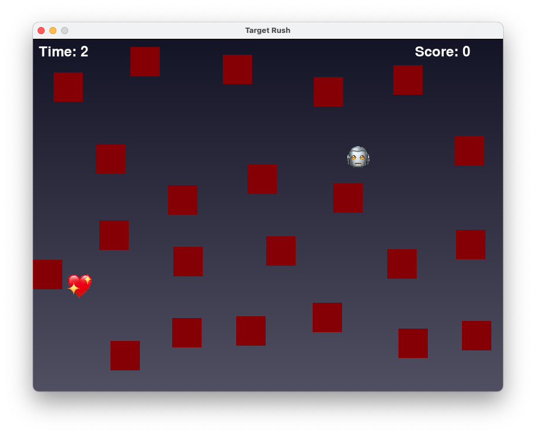
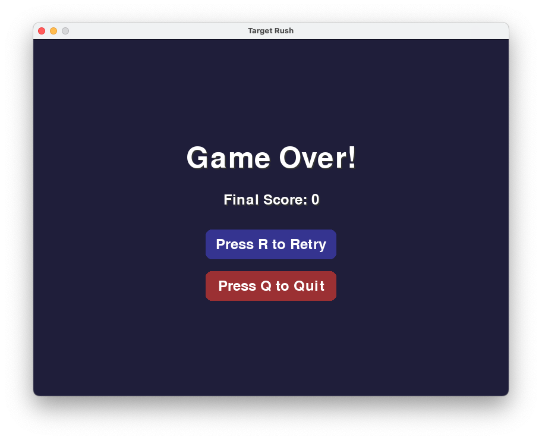

# Target Rush


**Target Rush** is a fast-paced arcade mini-game built with [Pygame](https://www.pygame.org/).  
Your mission is simple: **reach the red heart before time runs out**, dodging a maze of static obstacles.  
No power-ups, no second chances—just your reflexes and a ticking clock.

## Gameplay

- Controls:  
  Use `WASD` or the arrow keys (`← ↑ ↓ →`) to move.  
  Press `R` to retry.  
  Press `Q` to quit.

- Objective:  
  Navigate to the red heart as many times as possible. Each time you touch it, you gain **1 point**, and the heart moves to a new random (and safe) location.

- Obstacles:  
  Blocks randomly placed across the field. Touching them isn’t fatal—but you can’t pass through them.

- Timer:  
  You have **30 seconds** to score as high as possible. Once time is up, a **Game Over screen** appears with options to restart or quit.

## Project Structure

```plaintext
.
├── assets/
│   └── images/
│       ├── robot1.png     # The robot character
│       └── heart.png      # The lovable red target
│   └── sounds/
│       └── success.mp3    # Sound effect for scoring
├── background.py          # Gradient background rendering
├── game.py                # Core game loop and logic
├── main.py                # Entry point of the game
├── obstacle.py            # Obstacle generation and placement
├── player.py              # Player logic and movement
├── screens.py             # Game Over screen and buttons
├── settings.py            # Global constants and configuration
└── target.py              # Target logic and repositioning
```

## Requirements

- Python = 3.12.2
- Pygame = 2.6.1

## How to run

Launch the game with:

```plaintext
python src/game/main.py
```

Game parameters such as screen size, colors, player speed, and time limit can be customized by editing:

```plaintext
src/game/settings.py
```

## Features

- Pixel-perfect collision detection between player, obstacles, and target.
- Smart non-overlapping obstacle generation.
- Interactive Game Over screen with mouse and keyboard support.




